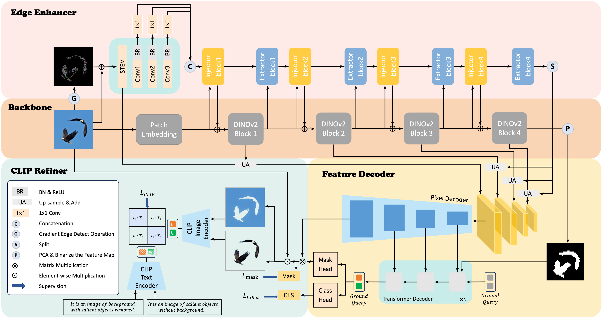

# FOCUS: Towards Universal Foreground Segmentation

<a href='https://geshang777.github.io/focus.github.io/'></a>
<a href='https://drive.google.com/drive/folders/1IcyZnqc4vcsvSUcKb2llYGPt3ClFGjPl'></a>


## Overview

<p align="center">
  
</p>

We introduce **FOCUS**, **F**oreground **O**bje**C**ts **U**niversal **S**egmentation framework that can handle multiple foreground tasks with one unified architecture. To achieve boundary-aware segmentation, we develop a multi-scale semantic network using the edge information of objects to enhance image features and propose a novel distillation method, integrating the contrastive learning strategy to refine the prediction mask in multi-modal feature space. Extensive experiments demonstrate that FOCUS achieves SoTA performance across five foreground segmentation tasks, including Salient Object Detection (SOD), Camouflaged Object Detection (COD), Shadow Detection (SD), Defocus Blur Detection (DBD), and Forgery Detection (FD).


## News


* [2025.01.03] [FOCUS(DINOv2-G)](https://drive.google.com/drive/folders/1IcyZnqc4vcsvSUcKb2llYGPt3ClFGjPl) checkpoints and [prediction results](https://drive.google.com/drive/folders/1Wz7x379hBSgtereYgw2Y8LMBiUV6g0J9) are now opensource. You can follow the guidelines [here](#quick-start) to quickly leverage the state-of-the-art performance of our model. Hope you enjoy it!
* [2024.12.16] Our code is released! Feel free to contact us if you have any questions!
* [2024.12.10] Our paper has been accepted by AAAI2025!🔥

## 🛠️Getting Started

### Environment Setup
* We use CUDA 12.2 for implementation.
* Our code is built upon Pytorch 2.1.1, please make sure you are using PyTorch ≥ 2.1 and matched torchvision. Besides, please check PyTorch version matches that is required by Detectron2.
* We train our models on  2 NVIDIA A6000 GPUs with 48G memory, please make sure that your VRAM is sufficient to avoid the potential OOM issues during training.


```bash
#create environment
conda create --name focus python=3.8
conda activate focus
pip install -r requirements.txt

#install detectron2
git clone git@github.com:facebookresearch/detectron2.git # under your working directory
cd detectron2 && pip install -e . && cd ..

#install other dependencies
pip install git+https://github.com/cocodataset/panopticapi.git
cd third_party/CLIP
python -m pip install -Ue .
cd ../../

#compile CUDA kernel for MSDeformAttn
cd focus/modeling/pixel_decoder/ops && sh make.sh && cd ../../../../
```

### Quick Start


We provide an inference demo here if you want to try out the our model. You should download the weights from our [Model Zoo](https://drive.google.com/drive/folders/1IcyZnqc4vcsvSUcKb2llYGPt3ClFGjPl) first and run the following command. Make sure that you use the config file conrresbonding to the download weights.

```bash
python demo/demo.py --config-file path/to/your/config \
  --input path/to/your/image \
  --output path/to/your/output_file \
  --opts MODEL.WEIGHTS path/to/your/weights
```

### Prepare Datasets

You should download required dataset ([CAMO](https://drive.google.com/drive/folders/1h-OqZdwkuPhBvGcVAwmh0f1NGqlH_4B6), [COD10K](https://drive.google.com/file/d/1vRYAie0JcNStcSwagmCq55eirGyMYGm5/view), [CHAMELEON](https://www.polsl.pl/rau6/datasets/), [NC4K](https://drive.google.com/file/d/1kzpX_U3gbgO9MuwZIWTuRVpiB7V6yrAQ/view), [DUTS](http://saliencydetection.net/duts/), [DUTOMRON](http://saliencydetection.net/dut-omron/download/DUT-OMRON-image.zip), [HKU-IS](https://pan.baidu.com/s/1c0EpNfM), [ECSSD](https://www.cse.cuhk.edu.hk/leojia/projects/hsaliency/dataset.html), [PASCAL-S](https://pan.baidu.com/s/1DZcfwCYdeMW4EGawhXQyig#list/path=%2Fsharelink2919409550-15531972684422%2FPASCAL-S&parentPath=%2Fsharelink2919409550-15531972684422), [ISTD](https://drive.google.com/file/d/1I0qw-65KBA6np8vIZzO6oeiOvcDBttAY/view), [DUT/CUHK](https://drive.google.com/file/d/1DtWbMUppxa8eC0O3ZVBjLQO_i5GUG1pa/view), [CASIA1.0](https://github.com/namtpham/casia1groundtruth), [CASIA2.0](https://drive.google.com/file/d/1IDUgcoUeonBxx2rASX-_QwV9fhbtqdY8/view)) into the `datasets` folder following

```
datasets/
├── CAMO-V.1.0-CVIU2019
│   ├── GT
│   ├── Images
│   │   ├── Test
│   │   └── Train
├── CASIA
│   ├── CASIA 1.0 dataset
│   ├── CASIA 1.0 groundtruth
│   ├── CASIA2.0_Groundtruth
│   └── CASIA2.0_revised
├── CHAMELEON
│   ├── GT
│   └── Imgs
├── COD10K-v3
│   ├── Test
│   └── Train
├── DEFOCUS
│   └── dataset
│       ├── test_data
│       │   ├── CUHK
│       │   └── DUT
│       └── train_data
│           ├── 1204gt
│           └──  1204source
├── DUTOMRON
│   ├── DUT-OMRON-image
│   └── pixelwiseGT-new-PNG
├── DUTS
│   ├── DUTS-TE
│   └── DUTS-TR
├── ECSSD
│   ├── ground_truth_mask
│   └── images
├── HKU-IS
│   ├── gt
│   └── imgs
├── ISTD_Dataset
│   ├── test
│   └── train
├── NC4K
│   ├── GT
│   └── Imgs
├── PASCAL
│   └── Imgs
```

and run the corresponding dataset preparation script by running:

```bash
python utils/prepare/prepare_<dataset>.py

# e.g. python utils/prepare/prepare_camo.py
```


### Prepare Pretrained Weights

download pre-trained DINOv2 weights by:

```bash
#dinov2-g
wget -P ./ckpt https://dl.fbaipublicfiles.com/dinov2/dinov2_vitg14/dinov2_vitg14_reg4_pretrain.pth

#dinov2-l
wget -P ./ckpt https://dl.fbaipublicfiles.com/dinov2/dinov2_vitl14/dinov2_vitl14_reg4_pretrain.pth
```

and run the following line to convert DINOv2 weights into detectron2 format while prepare ResNet weights for edge enhancer

```bash
#dinov2-g
python utils/convert_dinov2.py ./ckpt/dinov2_vitg14_reg4_pretrain.pth ./ckpt/dinov2_vitg14_pretrain_updated.pkl

#dinov2-l
python utils/convert_dinov2.py ./ckpt/dinov2_vitl14_reg4_pretrain.pth ./ckpt/dinov2_vitl14_pretrain_updated.pkl

```


## Training
```bash
python train_net.py \
--config-file path/to/your/config \
--num-gpus NUM_GPUS
```

## Evaluation

```bash
python train_net.py --eval-only \
--config-file path/to/your/config \
--num-gpus NUM_GPUS \
MODEL.WEIGHTS path/to/your/weights
```

## Citation

If you think our work is helpful, please star this repo and cite our paper!

```
@inproceedings{
you2025focus,
title={{FOCUS}: Towards Universal Foreground Segmentation},
author={You, Zuyao and Kong, Lingyu and Meng, Lingchen and Wu, Zuxuan},
booktitle={AAAI},
year={2025},
}
```

## Acknowledgements
FOCUS is built upon [Mask2Former](https://github.com/facebookresearch/Mask2Former), [CLIP](https://github.com/openai/CLIP), [ViT-Adapter](https://github.com/czczup/ViT-Adapter), [OVSeg](https://github.com/facebookresearch/ov-seg/), and [detectron2](https://github.com/facebookresearch/detectron2). We express our gratitude to the authors for their remarkable work.
